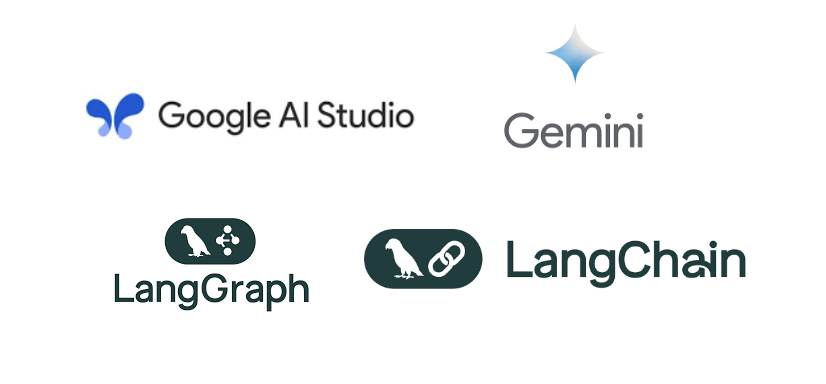
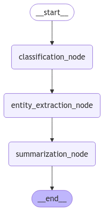
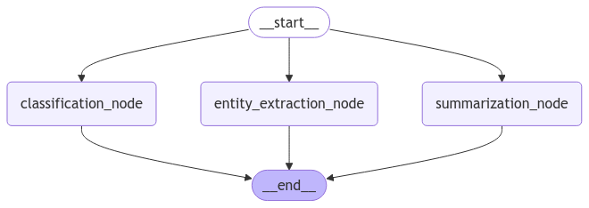

Trong bài viết hôm nay, chúng ta sẽ khám phá **Dự án đầu tiên của series LangGraph**. Đây là một dự án đầy thú vị tập trung vào việc xây dựng một pipeline phân tích văn bản tự động hóa, bao gồm ba nhiệm vụ quan trọng:

1. **Phân loại văn bản**
2. **Trích xuất thực thể**
3. **Tóm tắt văn bản**

Hãy cùng đi qua từng bước trong hành trình xây dựng và tối ưu hóa pipeline này nhé!

---

## 1. Tổng quan dự án

Mục tiêu chính của dự án là tự động xử lý các văn bản đầu vào và biến đổi chúng thành các thông tin có cấu trúc hữu ích. Để đạt được điều đó, chúng ta sẽ sử dụng **LangGraph**, một công cụ mạnh mẽ giúp tạo ra các luồng công việc xử lý ngôn ngữ tự nhiên (NLP) theo cách trực quan và hiệu quả. Bên cạnh đó, dự án còn tận dụng sức mạnh của các mô hình ngôn ngữ lớn (LLMs) được cung cấp bởi **Google AI Studio**.



## 2. Cấu trúc pipeline

Pipeline của chúng ta bao gồm các thành phần chính sau:

1. **Khởi tạo trạng thái:** Đây là nơi lưu trữ dữ liệu và kết quả của từng bước trong pipeline, bao gồm văn bản đầu vào, kết quả phân loại, thực thể được trích xuất, và tóm tắt.
2. **Sử dụng mô hình ngôn ngữ lớn (LLM):** Mô hình ngôn ngữ **Gemini-1.5-flash-001** của Google AI được sử dụng để đảm bảo độ chính xác cao và phản hồi nhanh chóng.
3. **Xây dựng các nút (node):**
    - **Phân loại văn bản:** Xác định loại văn bản (tin tức, blog, nghiên cứu, hoặc khác).
    - **Trích xuất thực thể:** Trích xuất các thực thể như người, tổ chức, và địa điểm.
    - **Tóm tắt văn bản:** Tạo một câu tóm tắt ngắn gọn mô tả nội dung chính.
4. **Xây dựng và trực quan hóa workflow:** Kết nối các nút bằng LangGraph để tạo ra một luồng công việc logic và hiển thị chúng dưới dạng đồ thị.
5. **Tối ưu hóa:** Tái cấu trúc workflow để chạy song song các nút độc lập, giúp cải thiện hiệu năng.

## 3. Quá trình thực hiện

### 3.1 Cài đặt thư viện cần thiết

Pipeline bắt đầu bằng việc cài đặt các thư viện như **LangChain**, **LangGraph**, và **LangChain Google GenAI**.

```python
!pip install langchain langchain_core langchain_community langgraph -q
!pip install langchain_google_genai -q
```

### 3.2 Khởi tạo trạng thái

Sử dụng `TypedDict` để định nghĩa trạng thái của pipeline:

```python
class State(TypedDict):
    text: str
    classification: str
    entities: List[str]
    summary: str
```

### 3.3 Tích hợp mô hình ngôn ngữ lớn

Google AI Studio cung cấp các mô hình ngôn ngữ mạnh mẽ và dễ tích hợp:

```python
from langchain_google_genai import ChatGoogleGenerativeAI

llm = ChatGoogleGenerativeAI(
    model="gemini-1.5-flash-001",
    temperature=0.9
)
```

### 3.4 Xây dựng các node

Mỗi node đảm nhận một nhiệm vụ cụ thể trong pipeline:

- Node phân loại văn bản:

    ```python
    def classification_node(state: State):
        prompt = PromptTemplate(
            input_variables=["text"],
            template="""Classify the following text into one of the categories: News, Blog, Research or Other. ..."""
        )
        message = HumanMessage(content=prompt.format(text=state["text"]))
        classification = llm.invoke([message]).content.strip()
        return {"classification": classification}
    ```

- Node trích xuất thực thể: Trích xuất tên người, tổ chức và địa điểm từ văn bản:

    ```python
    def entity_extraction_node(state: State):
      prompt = PromptTemplate(
          input_variables=["text"],
          template="""Extract the following entities (Person, Organization, Location) from the text.
                      \nNote: Provide the result as a comma seperated list
                      \nText: {text}
                      \nEntities:
                   """
      )
      message = HumanMessage(content=prompt.format(text=state["text"]))
      entities = llm.invoke([message]).content.strip().split(",")
      return {"entities": entities}
    ```

- Node tóm tắt văn bản: Tạo câu tóm tắt ngắn gọn chỉ trong một câu:

    ```python
    def summarization_node(state: State):
      prompt = PromptTemplate(
          input_variables=["text"],
          template="""Summarize the following text.
                      \nNote: Provide the result in one sentence
                      \nText: {text}
                      \nSummary:
                   """
      )
      message = HumanMessage(content=prompt.format(text=state["text"]))
      summary = llm.invoke([message]).content.strip()
      return {"summary": summary}
    ```


Toàn bộ các node đều được xử lý bởi mô hình Gemini.

### 3.5 Xây dựng và kiểm thử workflow

Sử dụng LangGraph để kết nối các node, tạo nên pipeline hoàn chỉnh:

```python
graph = StateGraph(State)

graph.add_node("classification_node", classification_node)
graph.add_node("entity_extraction_node", entity_extraction_node)
graph.add_node("summarization_node", summarization_node)

graph.set_entry_point("classification_node")

graph.add_edge("classification_node", "entity_extraction_node")
graph.add_edge("entity_extraction_node", "summarization_node")
graph.add_edge("summarization_node", END)

graph = graph.compile()
```

Dưới đây là sơ đồ minh họa pipeline:



## 4. Tối ưu hóa pipeline

Ban đầu, pipeline chạy tuần tự, dẫn đến hiệu năng không cao. Sau khi phân tích, nhận thấy các node hoạt động độc lập, chúng ta tái cấu trúc pipeline để các node chạy song song.

- **Pipeline chưa tối ưu:** Chạy các node lần lượt.
- **Pipeline tối ưu:** Cho phép các node độc lập khởi chạy song song.



Bảng so sánh hiệu năng:

| Graph chưa tối ưu | Graph tối ưu |
| ----------------- | ------------ |
| 4.29 giây         | 1.96 giây    |

## 5. Kết luận

Dự án đầu tiên trong series LangGraph đã mang đến cái nhìn sâu sắc về cách xây dựng một pipeline NLP hiệu quả. Với sự hỗ trợ từ LangGraph và Google AI Studio, chúng ta có thể dễ dàng xây dựng và tối ưu hóa các luồng công việc xử lý văn bản.

Bạn có thể mở rộng pipeline này cho các ứng dụng thực tế như phân tích dữ liệu khách hàng, xử lý văn bản pháp lý, hay tạo báo cáo tự động.

**Lưu ý:** Một số đoạn code đã được giản lượt để tập trung vào trình bày ý tưởng chính của dự án. Bạn đọc có thể tham khảo toàn bộ mã nguồn tại: [https://colab.research.google.com/drive/1fBz19tGC7BG0u6TwJG1HQsrvlN486NyU?usp=sharing](https://colab.research.google.com/drive/1fBz19tGC7BG0u6TwJG1HQsrvlN486NyU?usp=sharing)

---

🌟 Nếu bạn thấy bài viết này hữu ích, đừng quên để lại một ⭐ trên repo của tác giả nhé!

**Tác giả:** Trung Lê

📧 **Email:** lebaquoctrung@gmail.com

💻 **GitHub:** [LBQTrung](https://github.com/LBQTrung)

🌐 **Website:** [lbqtrung.github.io](https://lbqtrung.github.io/)
