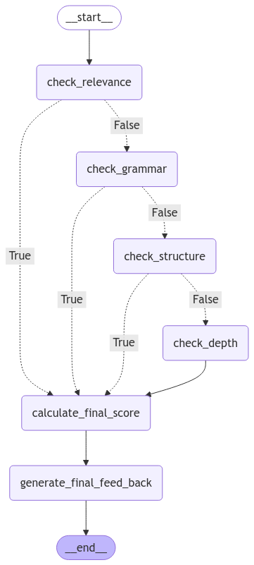

**Chào mừng bạn quay trở lại với series dự án của LangGraph!** Ở bài viết này, chúng ta sẽ cùng khám phá Dự án 2 - **Hệ Thống Chấm Điểm Bài Luận** 📃. Đây là một ứng dụng nâng cao của LangGraph, kết hợp kỹ thuật tiên tiến như **Cạnh điều kiện (Conditional Edges)** và **Cơ chế Đa Tác Vụ (Multi-Agent)** để đánh giá các bài luận theo nhiều tiêu chí khác nhau.

---

## 1. Tổng quan dự án

Dự án tập trung vào việc xây dựng hệ thống chấm điểm bài luận dựa trên bốn tiêu chí chính:

1. **Mức độ phù hợp của nội dung:** Bài luận có đáp ứng đúng chủ đề không?
2. **Kiểm tra ngữ pháp:** Độ chính xác của ngữ pháp và cách sử dụng ngôn ngữ.
3. **Phân tích cấu trúc:** Cách tổ chức và sự mạch lạc của bài luận.
4. **Chiều sâu phân tích:** Tư duy phản biện và mức độ sâu sắc trong ý tưởng.

## 2. Các kỹ thuật sử dụng

So với [dự án thứ 1](https://lbqtrung.github.io/posts/langgraph-project-1/), dự án này có một số cải tiến sau:

- **Cạnh điều kiện (Conditional Edges):** Tự động bỏ qua các bước kiểm tra nếu một tiêu chí không đạt mức tối thiểu (ví dụ: nếu nội dung không liên quan thì không cần kiểm tra ngữ pháp hay cấu trúc).
- **Hệ thống đa tác vụ:** Mỗi tác vụ đảm nhận một tiêu chí cụ thể trong bài luận.
- **Xử lý lỗi:** Dự án sử dụng biểu thức chính quy để trích xuất điểm và xử lý trường hợp mô hình không trả về kết quả đúng định dạng.
- **Tích hợp LangGraph:** Mô hình hóa quy trình chấm điểm thành một workflow trực quan.

## 3. Triển khai dự án

### 3.1 Định nghĩa State

State lưu trữ dữ liệu đầu vào (bài luận) và đầu ra (điểm số, phản hồi).

```python
class State(TypedDict):
  essay: str
  relevance_score: float
  grammar_score: float
  structure_score: float
  depth_score: float
  feed_backs: list[str]
  final_score: float
  final_feed_back: str
```

### 3.2 Xây dựng các node

Mỗi node đại diện cho một tiêu chí chấm điểm. Ví dụ, đây là node kiểm tra **mức độ phù hợp:**

```python
def check_relevance(state: State) -> State:
  prompt = ChatPromptTemplate.from_template(
      "Analyze the relevance of the following essay to the given topic. "
      "Provide a relevance score between 0 and 10. Your response should start with 'Score:' followed by a numeric score."
      "\n\nEssay: {essay}"
  )
  result = llm.invoke(prompt.format(essay=state["essay"]))
  try:
    state["relevance_score"] = extract_score(result.content)
    state["feed_backs"].append(extract_feed_back(result.content))
  except ValueError as e:
    print(f"Error in check relevance: {e}")
    state["relevance_score"] = 0.0
  return state
```

Tương tự, các node kiểm tra ngữ pháp, cấu trúc, và chiều sâu cũng được thiết kế theo cách này.

Tiếp theo, Node tính tổng điểm cuối cùng, mỗi tiêu chí sẽ có một trọng số riêng (mọi người có thể thay đổi cho phù hợp với tiêu chí bài luận của mỗi người):

```python
def calculate_final_score(state: State) -> State:
  state["final_score"] = round(
      (state["relevance_score"] * 0.3 +
      state["grammar_score"] * 0.2 +
      state["structure_score"] * 0.3 +
      state["depth_score"] * 0.2),
      1
  )
  return state
```

Ngoài ra, sau khi đã kiểm tra tất cả các tiêu chí, một node tổng hợp các feedback được thêm vào, để trả về một feedback tổng quát, ngắn gọn cho học viên:

```python
def generate_final_feed_back(state: State) -> State:
  feed_backs = ""
  for index, feed_back in enumerate(state["feed_backs"]):
    feed_backs += f"Feedback {index + 1}: {feed_back}\n\n"

  prompt = ChatPromptTemplate.from_template(
      "Base on feedback list, summarize t into a concise and, "
      "clear final feedback that highlights the main mistakes or areas for improvement"
      "Focus on providing actionable insights that help the student understand their errors" 
      "and improve for future tests"
      "Feedback list: {feed_backs}"
  )

  result = llm.invoke(prompt.format(feed_backs=feed_backs))
  state["final_feed_back"] = result.content
  return state
```

### 3.3 Cấu hình WorkFlow

Hệ thống được thiết kế dựa vào **StateGraph**, trong đó các node được liên kết dựa trên **Cạnh Điều Kiện**:

- **Điểm dưới ngưỡng (5):** Hệ thống bỏ qua các bước kiểm tra tiếp theo và chuyển đến bước tính điểm.
- **Điểm đạt ngưỡng:** Tiếp tục kiểm tra các tiêu chí khác.

**Vậy vì sao phải có ngưỡng?** 

Nếu bài luận không đáp ứng **tiêu chí phù hợp với nội dung** (điểm thấp hơn ngưỡng), việc tiếp tục kiểm tra các tiêu chí khác là **không cần thiết**, vì kết quả cuối cùng sẽ không đạt yêu cầu.

```python
graph = StateGraph(State)
graph.add_node("check_relevance", check_relevance)
graph.add_node("check_grammar", check_grammar)
# ... Các node khác

graph.add_conditional_edges(
    "check_relevance",
    lambda state: state["relevance_score"] < 5,
    {True: "calculate_final_score", False: "check_grammar"}
)
# ... Các cạnh điều kiện khác

graph.add_edge("check_depth", "calculate_final_score")
graph.add_edge("calculate_final_score", "generate_final_feed_back")

graph.set_entry_point("check_relevance")
graph.add_edge("generate_final_feed_back", END)

graph = graph.compile()

```

Sơ đồ minh họa Graph:



### 3.4 Hàm chấm điểm hoàn chỉnh

Hàm `grade_essay` thực hiện toàn bộ quy trình chấm điểm bài luận:

```python
def grade_essay(essay: str):
  initial_state = State(
      essay=essay,
      feed_backs=[],
      relevance_score=0.0,
      grammar_score=0.0,
      structure_score=0.0,
      depth_score=0.0,
      final_score=0.0
  )
  result = graph.invoke(initial_state)
  return {
      "relevance_score": result["relevance_score"],
      "grammar_score": result["grammar_score"],
      "structure_score": result["structure_score"],
      "depth_score": result["depth_score"],
      "final_score": result["final_score"],
      "final_feed_back": result["final_feed_back"]
  }
```

## 4. Thử nghiệm hệ thống

Bài luận mẫu:

```
Topic: The Impact of Social Media on Modern Communication

Social media has changed the way people communicate in many ways. It allows us to
stay connected with friends and family, no matter where they are in the world. Apps
like Facebook, Instagram, and WhatsApp make it easy to share photos, videos, and messages
instantly. This has made communication faster and more convenient than ever before.

However, social media also has its downsides. People sometimes spend too much time
online and less time talking face-to-face. This can weaken personal relationships
and make people feel lonely. In addition, online communication often lacks emotions,
making it harder to understand the true meaning behind someone's words.

Another issue is that social media can spread misinformation quickly. Fake news or
rumors can go viral and mislead people. It is important to be careful about what we
read and share online.

In conclusion, social media has both positive and negative effects on communication.
While it makes it easier to connect with others, it is important to use it wisely and
not let it replace real-life interactions.
```

Kết quả:

- **Điểm phù hợp:** 9.0
- **Điểm ngữ pháp:** 8.0
- **Điểm cấu trúc:** 6.0
- **Điểm chiều sâu:** 3.0
- **Điểm cuối cùng:** 6.7
- **Nhận xét:** The essay effectively addresses the prompt and demonstrates good grammar and structure.  However, the analysis of social media's impact is superficial.  To improve, delve deeper into specific aspects, such as the effects on different demographics or the evolution of communication styles.  Consider using semicolons to improve sentence flow and enhance the analysis with more critical thinking to move beyond simply identifying positive and negative impacts.

## 5. Kết luận

Dự án thứ hai trong series LangGraph không chỉ là một ví dụ tuyệt vời về việc áp dụng AI trong giáo dục mà còn minh họa cách thiết kế workflow thông minh bằng LangGraph. **Bạn có thể áp dụng framework này vào các bài toán khác, như đánh giá hồ sơ xin việc, phân tích báo cáo kinh doanh, v.v.**

Hãy để lại nhận xét hoặc câu hỏi của bạn bên dưới. Đừng quên theo dõi mình để cập nhật thêm các dự án tiếp theo! 🚀

Tham khảo toàn bộ mã nguồn dự án tại: [https://colab.research.google.com/drive/1hdYzXLVRWCxU51b-rQ3G-MEGbi-sjgrW?usp=sharing](https://colab.research.google.com/drive/1hdYzXLVRWCxU51b-rQ3G-MEGbi-sjgrW?usp=sharing)

---

🌟 Nếu bạn thấy bài viết này hữu ích, đừng quên để lại một ⭐ trên repo của tác giả nhé!

**Tác giả:** Trung Lê

📧 **Email:** lebaquoctrung@gmail.com

💻 **GitHub:** [LBQTrung](https://github.com/LBQTrung)

🌐 **Website:** [lbqtrung.github.io](https://lbqtrung.github.io/)
